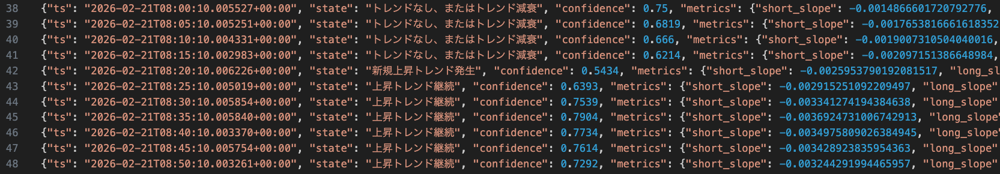

# 概要

画像解析だけで売買判断できるか試してみる → やはり効率悪そう

# GMMAトレンド判定ツール

* 株/FXなどのチャート画像 [capture.png](./capture.png)を解析して、GMMA(Guppy Multiple Moving Averageのトレンドを5分類で判定し、[trend-report.log](./trend-report.log))にJSONL形式で追記
  * チャート画像は[TV Browser](https://github.com/hirotgr/tv-browser)のPeriodic Screen Capture機能を使用して自動更新されることが前提
  * 視覚ノイズになるような要素は非表示にする必要がある
* ローソク足(OHLC)データやインジケーター数値ではなく純粋に画像処理でトレンド判定することが目的
  * アプリ作成のお勉強が主目的なので儲かるかどうかは知らん
* 詳細は [./implementation.md](./implementation.md)を参照


## ステータス

* **version 0.1.0**: 画像認識と基礎的なトレンド判定
  * コンセプト確立優先なので、MTF(Multiple Time Frame)チャートのうち、5分チャートだけを画像解析
  * ROI(Region of Interest)を切り出してノイズ削減
  * 短期群/長期群をそれぞれ1本の代表ラインに圧縮して判定しているが、重心が線群の中央値なのでトレンド判定が遅すぎる
  * **一応、画像処理だけでトレンド判定できそうだけど、やはり汎用性がなさすぎると判断したので、一旦この状態でお休み**
  * 素直にTradingViewのPINE scriptのアラートをWebhookで飛ばしてCloudflare Tunnel経由で受け取る方が効率的か..


## 依存

- `python3`
- `magick` (ImageMagick)

## 1回だけ実行（認識確認込み）

```bash
python3 run_gmma_report.py \
  --image ./capture.png \
  --log ./trend-report.log \
  --state ./state/gmma-state.json \
  --probe-layout \
  --once
```

`--probe-layout` は4分割チャート（日足/1時間/15分/5分）とGMMA色抽出可否を表示

## 常駐実行（5分ごと）

ラッパースクリプト[start-gmma-monitor.sh](./start-gmma-monitor.sh)を実行

```bash
python3 run_gmma_report.py \
  --image ./capture.png \
  --log ./trend-report.log \
  --state ./state/gmma-state.json \
  --interval-seconds 300
```

- CRONは不要です。プロセスが生きている限り5分ごとに判定します。
- `--once` なしの場合、初回は即時実行せず「次の5分境界 + 10秒」で実行します。
- 各サイクルは毎回「5分境界 + 10秒」に再同期します（処理時間によるドリフトを抑制）。
- 目標時刻到達後、`capture.png` 更新を最大30秒待機します。
- 実行時に標準出力へも同じJSONを1行出力します。

## 判定カテゴリ

- 新規上昇トレンド発生
- 上昇トレンド継続
- トレンドなし、またはトレンド減衰
- 新規下落トレンド発生
- 下落トレンド継続

## 出力フォーマット（JSONL）

- `ts`
- `state`
- `confidence`
- `metrics` (`short_slope`, `long_slope`, `group_gap`, `short_spread`, `long_spread` など)
- `source_mtime`
- `note`


## 動作例

* 読み込みチャート画像


* トレンド判定

