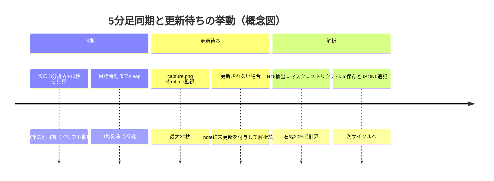

# GMMA画像解析ベースFXトレンド検出スクリプトの深掘り調査

## エグゼクティブサマリー

本スクリプトは、`capture.png`（5分ごとに更新される前提）を画像として読み取り、画面の4分割チャートのうち**右下（5分足）**だけを対象に、GMMA（短期群・長期群の2束）を「新規上昇／上昇継続／中立（トレンドなし・減衰）／新規下落／下落継続」の5分類で判定し、JSONLログに追記します。実装は、画像デコーダとして **entity["company","ImageMagick","image processing suite"]** の `magick ... txt:-`（ピクセル列挙）を用い、OpenCV/Pillowには依存しません。fileciteturn0file0

トレンド判定は、GMMAの12本を個別に復元する方式ではなく、**短期群（紫系）と長期群（オレンジ系）をそれぞれ「代表線（中央値ライン）」へ圧縮**し、右端20%区間における（a）代表線の傾き（線形回帰）、（b）短期群と長期群の上下位置差（gap）、（c）短期群の群内拡散（IQR由来のspread）、（d）長期群傾き、を閾値付きスコアに変換して重み付き合成し、上昇／下落／中立を決めます。さらに前回状態（stateファイル）を参照して新規/継続に分岐します。fileciteturn0file0

一次資料のGMMA原理では、**長期群の分離がトレンド強弱、短期群の分離が売買活動、両群間の分離がトレンド性格、圧縮が価格合意**を示す、と整理されます（また「単純なMAクロスツールとして使うな」という注意も明記）。本実装はこのうち「分離/圧縮」を、ピクセル幾何（gapとIQR）で近似している設計です。citeturn4view0

一方で、ユーザー要件として挙げられている「**緑の価格ラインの抽出**」「**ピクセル→価格/時刻スケールへの厳密な写像**」「**複数時間足の合議（5m/15m/1h/日足の確認）**」は、現行仕様では中心機能として実装されていません（4象限の“認識チェック”はありますが、判定自体は5分足のGMMA代表線に依存）。このギャップは、要件定義と運用期待を揃えるうえで重要です。fileciteturn0file0

## 運用仕様

本ツールは、常駐ループを管理するランナーと、画像からメトリクスを抽出して状態分類するアナライザに分かれます。ランナーは「次の5分境界＋10秒」に実行時刻を再同期し、到達後に`capture.png`更新を最大30秒待ち、解析を実行します。解析結果は `trend-report.log` に1行1JSON（JSONL）で追記し、前回状態は `state/gmma-state.json` に保存されます。fileciteturn0file0 fileciteturn0file1

```mermaid
flowchart TD
  A[capture.png 更新] --> B[次の5分境界+10秒まで待機]
  B --> C[更新待ち(最大30秒)]
  C --> D[ImageMagickでROIをtxt:-へ]
  D --> E[HSV色マスクで短期/長期GMMA抽出]
  E --> F[右端20%で代表線(中央値)とIQR算出]
  F --> G[傾き/ギャップ/拡散→スコア]
  G --> H[上昇/下落/中立 + 新規/継続を決定]
  H --> I[trend-report.logへJSONL追記]
  H --> J[state/gmma-state.json更新]
```

入力の取り扱いは、画像サイズを取得し、画面を左右上下で**固定4分割**して（左上=日足、右上=1時間、左下=15分、右下=5分）矩形を定義します。各象限ではさらにヘッダ・余白・右軸ラベル等を避けるため、内側にROIを切り出します（左余白+6%、上ヘッダ+8%、幅84%、高さ82%）。fileciteturn0file0

このROIに対し、RGB→HSV変換後の色閾値でピクセルを分類します。暗い領域（V<0.22）は背景として無視し、短期GMMA（紫系：H 282–322, S≥0.10）、長期GMMA（オレンジ系：H 20–45, S≥0.25）などのマスクを作ります。レイアウト認識のために陽線/陰線相当の色カウントも行い、一定以上のピクセル数があるかで象限の認識可否を判定します。fileciteturn0file0

ImageMagickの`txt:`（ピクセル列挙）形式は、**各ピクセルが1行**で出力され、ヘッダに画像サイズ等が入ります。出力行数はピクセル数に等しくなり得るため、ROIが大きいほどI/O負荷が増えます。citeturn9view0  
また`txt:`のコメント部はバージョン等で変動し得るため、パーサは先頭の座標＋括弧内数値だけに依存する設計が堅牢です（ImageMagick側も「コメント部に依存しない」注意を示しています）。citeturn9view0

サイクル同期は、処理時間のドリフトを抑えるために毎回「次の5分境界＋10秒」を再計算します。更新待ちがタイムアウトしても解析は行い、ログの`note`に未更新旨を付けます。fileciteturn0file0 fileciteturn0file1

## トレンド判定ロジックの詳細

### GMMA原理との対応づけ

一次資料では、GMMAは2群（短期=トレーダー、長期=投資家）のEMA束の関係を用い、**群内/群間の分離や圧縮（compression）**からトレンド環境や合意/不一致を読む、と説明されます。特に「長期群の分離がトレンド強弱」「短期群の分離が取引活動」「群間分離がトレンド性格」「圧縮が価格と価値の合意」をルールとして掲げています。citeturn4view0  
また、GMMAを「単純なMAクロス」だけで扱うことへの注意も明記されています。citeturn4view0

本実装は、GMMAの**分離/圧縮**を、画像上の幾何量として次のように近似します。fileciteturn0file0

- 群間分離：短期群代表線と長期群代表線の上下位置差（`group_gap`）  
- 群内圧縮：短期群ピクセルの列内IQR平均（`short_spread`。小さいほど収束）  
- 方向：代表線の傾き（`short_slope`, `long_slope`。画像座標y増加が下方向のため符号反転に注意）  
- 「新規/継続」：前回状態の参照（ヒステリシスの最小形）

なお、典型的なGMMAの期間は（短期：3,5,8,10,12,15／長期：30,35,40,45,50,60）として広く実装されています。citeturn3view0turn4view0turn1search10  
ただし本スクリプト自体は**期間設定を画像から読み取らない**ため、チャート側のGMMA設定が異なる場合でも検出ロジックは同一で動作します（=「GMMAとして意味づけられている束」が期待どおりかは外部設定に依存）。fileciteturn0file0

image_group{"layout":"carousel","aspect_ratio":"16:9","query":["Guppy Multiple Moving Average GMMA short term long term groups example chart","GMMA compression separation between bands example"],"num_per_query":1}

### 代表線抽出の数学的定義

右下（5分足）ROIのうち、**右端20%**（`x >= 0.80 * roi_w`）を評価区間とします。各x列ごとに、短期色マスクに該当したピクセルのy座標集合 \(Y^{(S)}_x\)、長期色マスクの集合 \(Y^{(L)}_x\) を集めます。fileciteturn0file0

列代表値は中央値で定義されます。中央値は外れ値に対して頑健であり、画像ノイズ（アイコン、交差点付近の色混ざり等）に強いという期待と整合します。fileciteturn0file0 citeturn8search1turn8search2

\[
\tilde{y}^{(S)}_x = \mathrm{median}(Y^{(S)}_x),\quad
\tilde{y}^{(L)}_x = \mathrm{median}(Y^{(L)}_x)
\]  

群内拡散（spread）はIQRで近似されます。IQRは分布の中位50%に基づく頑健な散布尺度で、外れ値耐性（breakdown point 25%）の文脈でよく用いられます。fileciteturn0file0 citeturn2search21turn2search15

\[
\mathrm{IQR}(Y_x)=Q_3(Y_x)-Q_1(Y_x)
\]

代表線の傾きは、点列 \((x,\tilde{y}_x)\) に対する単回帰（OLS）で求めます。OLS傾きは
\[
\hat{\beta}=\frac{\sum_i (x_i-\bar{x})(y_i-\bar{y})}{\sum_i (x_i-\bar{x})^2}
\]
で与えられます。citeturn8search0turn8search12  
本実装では、画面解像度やROIサイズに依存しにくくするため、傾きをROI高さで正規化します（`/ roi_h`）。fileciteturn0file0

### メトリクスの意味と符号

本実装のメトリクスはすべてROI高さで正規化され、**価格そのもの（JPYなど）には写像されません**。つまり「ピクセル幾何としてのトレンド傾向」を扱います。fileciteturn0file0  
例として、保存状態ファイルに記録されたROI寸法（`roi_width`, `roi_height`）と各メトリクスが確認できます。fileciteturn0file2

主要メトリクスは次の通りです（括弧内は実装上の解釈）。fileciteturn0file0

- `short_slope`, `long_slope`：代表線の正規化傾き。画像ではyが下に増えるため、**負=上向き（上昇寄り）／正=下向き（下落寄り）**。fileciteturn0file0  
- `group_gap = (long_mean_y - short_mean_y) / roi_h`：群間の上下位置差。**正なら短期群が長期群より上**（価格的に高位）と解釈。fileciteturn0file0  
- `short_spread`, `long_spread`：列IQRの平均を正規化した群内拡散度。小さいほど「束が締まる（圧縮）」に相当。fileciteturn0file0  
- `short_columns`, `long_columns`：右端20%領域で代表点が作れた列数（品質指標）。fileciteturn0file0  

ここで重要なのは、GMMA一次資料が述べる「compression（圧縮）＝合意」は**“群内/群間の幾何的凝集”**として解釈できる一方、本実装の`spread_score`は**短期群が収束しているほどスコアが高い**設計であり、いわゆる「短期群が勢いで拡散する局面」を“強い”とみなす設計ではありません。この点はGMMAの読み方（トレンド継続局面の束の開きも重要という流派）と食い違い得るため、チューニング上の争点になります。fileciteturn0file0 citeturn4view0turn3view0

### スコアリングと状態分類

スコア計算は、しきい値を中心に0..1へクランプする形で定義されます。しきい値は次で固定です。fileciteturn0file0

- `slope_th = 0.0012`
- `long_slope_th = 0.0005`
- `gap_th = 0.03`
- `spread_th = 0.075`

たとえば「上昇の短期傾きスコア」は、画像座標の符号を考慮して `-short_slope` を使い、閾値超過分を正規化します。fileciteturn0file0

擬似コードとしては次の形です（実装定義と等価）。  

```python
# 0..1正規化（clamp）
up_slope  = clamp((-short_slope - slope_th) / (2*slope_th), 0, 1)
down_slope= clamp(( short_slope - slope_th) / (2*slope_th), 0, 1)

up_gap    = clamp(( group_gap - gap_th) / (2*gap_th), 0, 1)
down_gap  = clamp((-group_gap - gap_th) / (2*gap_th), 0, 1)

spread_ok = clamp((spread_th - short_spread) / spread_th, 0, 1)

up_long   = clamp((-long_slope - long_slope_th) / (2*long_slope_th), 0, 1)
down_long = clamp(( long_slope - long_slope_th) / (2*long_slope_th), 0, 1)

up_score   = 0.35*up_slope + 0.30*up_gap + 0.20*spread_ok + 0.15*up_long
down_score = 0.35*down_slope+0.30*down_gap+0.20*spread_ok+0.15*down_long
```

方向決定は、絶対強度（≥0.55）と相対優位（差≥0.08）の二段条件で、拮抗時の誤判定を抑える設計です。fileciteturn0file0

- 上昇：`up_score >= 0.55` かつ `up_score > down_score + 0.08`
- 下落：`down_score >= 0.55` かつ `down_score > up_score + 0.08`
- それ以外：中立

さらに抽出品質（列数）から `quality` を作り、信頼度を補正します。列数に基づく品質補正は、画像抽出パイプラインの“見えている量”に依存するため、マスクが壊れたときに confidence が自然に落ちる設計意図です。fileciteturn0file0

状態遷移（新規/継続）は前回状態ファイルを参照し、「上昇方向かつ前回が非上昇なら新規上昇」などの最小限のヒステリシスを持ちます。fileciteturn0file0  
保存される状態ファイルには `last_state`, `updated_at`, `source_mtime`, `metrics` が含まれます。fileciteturn0file0 fileciteturn0file2

## 失敗モードと対策

以下は、画像→GMMA抽出という方式に固有の失敗モードを、症状・根因・検知・緩和策として整理したものです。UIノイズについては、実装側の注意事項として具体的に「イベント表示・インジケータ名・価格ライン/ラベル等を隠す」ことが挙げられています。fileciteturn0file0  
また、色に基づく自動抽出はWebPlotDigitizer等でも中心戦略であり、ROI制限、色選択、色距離（許容誤差）が重要パラメータになります。citeturn5view0turn7search4

| 失敗モード | 主な症状 | 根因（画像側/実装側） | 検知の手がかり | 代表的な緩和策 |
|---|---|---|---|---|
| UIアイコン/イベント表示の混入 | `short_spread`が急増、列の外れ値、誤判定 | 紫/橙に近い色のバッジや文字がマスクに混入 | `short_pixels_right`の局所増・`IQR`増、`note`に抽出不足/不足直前 | チャート側でイベント表示・タイトル・値表示・右端ラベル/価格線等をOFF（仕様に明記）fileciteturn0file0 |
| テーマ/配色変更 | `short_pixels_total`や`long_pixels_total`が閾値未満で失敗 | HSV閾値が固定で、色相がずれると検出不能 | “GMMA色抽出が不足”で中立+confidence=0 | 色距離（許容差）方式への移行、起動時にサンプル色を拾い自動較正（WPDの色距離思想）citeturn5view0 |
| アンチエイリアス/線の細さ | 途切れ・列数低下・傾き不安定 | 線境界が背景と混色し、S/Vが閾値を割る | `short_columns`/`long_columns`低下、`quality`低下 | 近傍膨張（dilation）や色距離拡大、右端領域のみ高解像度キャプチャにする citeturn5view0 |
| 右軸・ラベル領域の侵入 | gapや傾きが不連続 | ROI設計が固定比率で、UIレイアウトが変わると右端要素が入る | 象限の`recognized`が落ちる／メトリクスの急変 | ROIを自動検出（軸検出）へ移行、もしくは右端の安全マージンを拡大 fileciteturn0file0 |
| ズーム/表示期間の変動 | 同じ`short_slope`閾値でも感度が変わる | ピクセル→時間/価格の写像を作っていないため、同じx幅が表す時間が可変（推論） | 同相場でも閾値反応が日によって変わる | 軸キャリブレーションに基づくピクセル→時刻/価格変換（WPD方式に近い）citeturn5view0 |
| GMMA設定変更（期間/本数/色） | トレンド判定がGMMAの意味から逸脱 | 実装は色束しか見ないため、設定差を検出できない | 目視と結果の乖離、長期群の傾きが不自然 | チャート設定を固定化し、設定をメタデータとして別途管理（手動/設定ファイル）citeturn4view0turn3view0 |
| “価格ライン（緑）”とGMMAの交差/重なり | 紫/橙の検出が局所的に欠ける | 線が重なると色が混ざる、線束交差部はエッジが複雑 | 列ごとのy分布が二峰性になり中央値がずれる | 交差部に強いロバスト回帰（RANSAC等）や、色分離をクラスタリングにする citeturn2search6turn5view0 |
| ImageMagick出力仕様の差 | HSV変換が破綻、全マスク崩壊 | `txt:`が16bitや%表記になる等（入力/設定/版差） | 色値が0–255でなくなると一斉に誤分類 | `magick`呼び出しに`-depth 8`等を付与し固定化（公式例で深度が変わり得ると明記）citeturn9view0 |
| 更新待ちタイムアウト/同一画像再解析 | 状態が停滞、同一判定の繰り返し | 画像生成側の遅延、mtime更新が遅い | `note`に `source_mtime未更新` | 生成側パイプラインを監視、更新遅延をメトリクス化、timeout調整 fileciteturn0file0 |

## 改善提案とチューニング指針

### 仕様ギャップの明確化

要件として挙げられた「緑の価格ライン抽出」「価格/時刻スケールへのマッピング」は、現行仕様では中心機能として定義されていません。現状は「GMMAの色束の幾何」を直接評価しており、価格ラインは（少なくとも仕様上）使いません。fileciteturn0file0  
この方式は、GMMA原理のうち“分離/圧縮”の視覚的特徴抽出に寄せた設計として合理性はありますが、**ズームや縦軸スケール変化の影響を受けやすい**という構造的弱点が残ります（ピクセル→値のキャリブレーションが無いため、同じピクセル差が示す価格差が一定でない、という意味での不安定性）。この点は、プロット画像から数値を取り出す分野で一般に「軸キャリブレーション」が必須になるという知見と整合します。citeturn5view0turn7search4

### ピクセル→価格/時刻写像の導入案

WebPlotDigitizerの高レベルワークフローは「ROI設定→軸キャリブレーション→（手動/自動）抽出→CSV出力」という順で、特に**既知値の点を使って軸をキャリブレーションし、任意ピクセルをデータ値へ変換する**ことが中心です。citeturn5view0turn7search4  
これを本件に適用するなら、少なくとも次のどれかが必要です。

- 右軸価格目盛りの検出（OCR）と、上限/下限アンカーから線形変換  
- グリッド間隔（水平線）と、表示レンジ（例：右軸ラベル2点）の組み合わせ  
- 画像生成側で「現在レンジ（min/max）」を別ファイルで吐く（最も堅牢）

同様に、x方向（時刻）は、表示期間が固定ならピクセル→バーindexの線形写像で足りますが、ズーム可変なら軸ラベル/グリッドからの較正が要ります。citeturn5view0

### 色マスクの頑健化とロバスト回帰

現行はHSV閾値の矩形領域で色を判定しています。色に基づく自動抽出では「近い色も取り込む（色距離）」が定石で、WebPlotDigitizerでも色距離の調整が前提になっています。citeturn5view0  
したがって、固定H範囲よりも、基準色（紫/橙）に対する距離（HSVまたはLab空間）で採否し、許容幅を運用で調整できるようにすると、テーマ差・アンチエイリアスに強くなります（提案）。

さらに、右端20%の点群から傾きを取る際、交差部やUIノイズは外れ値として出やすいので、OLSの代わりにRANSACなどの外れ値耐性回帰を選択肢にすると、傾き推定が壊れにくくなります。RANSACは外れ値を含むデータからモデルを推定する枠組みとして古典的に確立しています。citeturn2search6turn2search2

### GMMA解釈に沿ったスコア再設計の論点

一次資料では「長期群の分離がトレンド強弱」「短期群の分離が取引活動」「圧縮が合意」と整理されます。citeturn4view0turn3view0  
現行は短期群の収束（`short_spread`が小さい）を“良い”方向に使っていますが、実務的には（流派にもよるものの）**短期群の拡散が勢いの増大**を示すと読むケースもあり得ます。よって、次の2系統を分けて評価する設計が自然です（提案）。

- トレンド強度：長期群の分離（`long_spread`）と長期群の傾き（`long_slope`）を重視  
- エントリ局面：短期群の圧縮→再拡散（時間差分で`Δshort_spread`を見る）や、群間距離の縮小/拡大（`Δgroup_gap`）を重視  

この“時間差分”は、現行がシングルスナップショットであることの限界を埋めるため、stateに過去N回分のメトリクス履歴を保存するだけで導入できます（提案）。fileciteturn0file0

### パラメータチューニングの実務手順

現状のしきい値（`slope_th`等）と重みは固定で、しかもピクセル単位の特徴量です。したがって、最適化は「相場一般」ではなく「**特定のキャプチャ設定（解像度・ズーム・テーマ・線幅・GMMA色）**」に依存します。fileciteturn0file0  
推奨手順は次です（提案）。

- 過去画像を数百〜数千枚保存し、人手ラベル（上昇/下落/レンジ/転換）を付ける  
- しきい値と重みをグリッドサーチし、F1や誤警報率（false positive）で最適化  
- “新規トレンド”は誤警報コストが高いので、`0.55`や`+0.08`を上げて保守的にし、継続判定は少し緩める二段閾値（ヒステリシス）へ拡張する  

このとき、スナップショット分類を「転換」まで含めるなら、GMMA一次資料が強調する「圧縮が合意」「両群同時圧縮が再評価と転換可能性」というルールを、`short_spread`と`long_spread`の同時低下として直接特徴量化できます。citeturn4view0

### 実装修正案の最小diff例

ImageMagickの`txt:`出力は深度や色空間により数値のレンジが変わり得ます。仕様上の不確実性を下げるため、`-depth 8 -colorspace RGB -alpha off`を明示して**必ず0–255のRGB**を得るよう固定化する案です（機能互換を保ちつつ、失敗モードの一部を抑制）。ImageMagick側も深度で最大値が変わること、コメント部が変動し得ることを示しています。citeturn9view0

```diff
diff --git a/gmma_5m_analyzer.py b/gmma_5m_analyzer.py
@@ def pixel_stream_for_crop(
-    out = run_magick([image_path, "-crop", f"{w}x{h}+{x}+{y}", "+repage", "txt:-"])
+    out = run_magick([
+        image_path,
+        "-crop", f"{w}x{h}+{x}+{y}",
+        "+repage",
+        "-alpha", "off",
+        "-colorspace", "RGB",
+        "-depth", "8",
+        "txt:-",
+    ])
```

また、性能面では「ROI全体の`txt:`出力→右端20%だけ利用」という構造なので、右端20%だけを先にcropして出力行数を減らす最適化が有効です（ただし現行は“総ピクセル数が1000未満なら失敗”という品質ゲートがあるため、そのゲート定義も同時に調整が必要です）。fileciteturn0file0 citeturn9view0

## テスト設計と可視化例

### 単体テスト観点

画像解析は再現性が崩れやすいため、「画像に依存しない純関数」から固めるのが効果的です。現行仕様から、次が単体テスト候補になります。fileciteturn0file0

- `rgb_to_hsv()`：既知RGB（純赤/純緑/純青/灰色）でH,S,Vが妥当レンジになるか  
- `classify_color_masks()`：閾値境界の近傍で意図どおり分類されるか（V<0.22の除外含む）  
- `median()` / `iqr()`：外れ値混入時に頑健に動くか（IQRの定義はQ3-Q1）citeturn2search15  
- `linear_regression_slope()`：単調増加/減少の点列で符号と大きさが一致するか（OLS傾き定義）citeturn8search0  
- `trend_scores()`：閾値ちょうど／大幅超過のケースで0..1へクランプされるか  

### 統合テスト観点

統合テストは、実画像を使って「メトリクスが再現されること」をgolden test化するのが現実的です（チャートのテーマ変更等で壊れること自体を検知したい）。fileciteturn0file0

- 代表的な相場局面（明確上昇／明確下落／レンジ／転換）ごとに`capture.png`を固定保存し、`metrics`と`state`が期待レンジに入るかを検証  
- UI要素を意図的にONにした画像（イベント、タイトル、右軸ラベル）を混ぜて、ノイズ耐性がどの程度落ちるかを測定（仕様上は事前にOFF推奨）fileciteturn0file0  
- 解像度違い（例：フルHD/4K相当）で、正規化（`/roi_h`）がどこまで効くかを確認  
- ImageMagickバージョン差分：`txt:`の出力に差が出た場合でもパースできるか（コメント部の非依存性）citeturn9view0  

### 可視化の具体例

「どこを見て何が取れているか」を可視化するデバッグ出力は、画像解析系の調整コストを劇的に下げます（提案）。WebPlotDigitizerもROIと色抽出の“テスト”を強調しており、同様の発想です。citeturn5view0  

可視化例（出力画像として実装するとよいもの）：

- ROI枠（象限＋内側ROI＋右端20%区間）を矩形で描画  
- 紫/橙マスクを半透明オーバーレイ  
- 各x列の中央値点列（短期/長期）と回帰直線を重ね描き  
- `short_spread`/`group_gap`/スコア推移を時系列プロット（stateファイルに履歴を保存した場合）

### 実行タイミングのタイムライン例



上記のとおり、現在の実装は「GMMA束の視覚特徴（分離/圧縮/方向）」をスナップショットで判定する設計で、GMMA一次資料の“分離/圧縮”の読みを一定程度反映しています。citeturn4view0turn3view0  
ただし、画像ベースである以上、配色・UI・ズーム・軸など外部要因に支配されやすく、要件にある“価格ライン抽出”や“ピクセル→値の写像”を入れない限り、閾値最適化は**特定環境に閉じたチューニング**になります。この点は、プロット画像の数値化で軸キャリブレーションが中心工程になることからも裏づけられます。citeturn5view0turn7search4